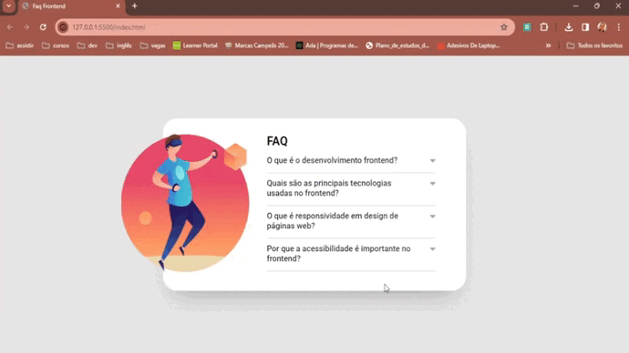

# FAQ Frontend
Desafio proposto pelo curso DevQuest para praticar DOM JavaScript.

## Demonstração

## Tecnologias
* HTML
* CSS
* JavaScript
* Git

## Aprendizados
Apesar das últimas aulas assistidas serem de JavaScript, o curso sempre propõe atividades que exigem a prática da tríade frontend: HTML, CSS e JS.

No módulo intermediário de JS, aprendemos como começar a adicionar interatividade às nossas páginas. Assim, com esse desafio, coloquei em prática dois elementos aprendidos: a busca e seleção de elementos com DOM e eventos. Para ser mais específica, utilizei o `querySelectorAll()` para exibir as perguntas e a respostas, e o evento de clique para permitir que o usuário clique na pergunta desejada e a abra para ver a resposta.

Confesso que foi um pouco desafiador, pois tive que trabalhar com todos os elementos que havia aprendido, como variáveis, estruturas condicionais, funções e DOM. Além disso, coloquei em prática uma dica que vi no curso de Clean Code, que é escrever o código em inglês para torná-lo mais acessível e legível para outras pessoas. Como estou aprendendo e esse código em particular é menor, foi trabalhoso, mas não impossível.